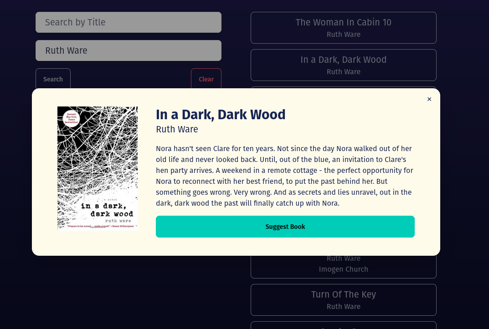
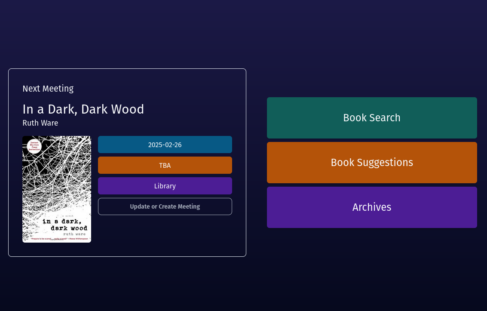

# bookclub-manager

## Description

This is a pet project for a local book club I joined. The idea is to allow users (members of the club) to search for books and suggest them to the group, utilizing the Open Library API. Members can also vote for the books they like. The group admin can schedule meetings and approve book suggestions. The interface also features all the information about upcoming meetings, as well as an archive of past meetings and the books read.

## Tech Stack

- Node.JS
- React
- Tailwind
- DaisyUI
- PostgreSQL
- Open Library API
- Sequelize
- Nginx
- Docker

## Usage

This app is still in the development phase, as of Jan 31, 2025. In theory, one could clone the repo and set it up locally in docker.

## Design

### Fully Responsive

### Cover Images Included

### Easy-to-read dashboard

## Contact me:

email: [alexgeorgegeer@gmail.com](alexgeorgegeer@gmail.com)

## License

Licensed under the [MIT](https://opensource.org/license/mit/) license.
