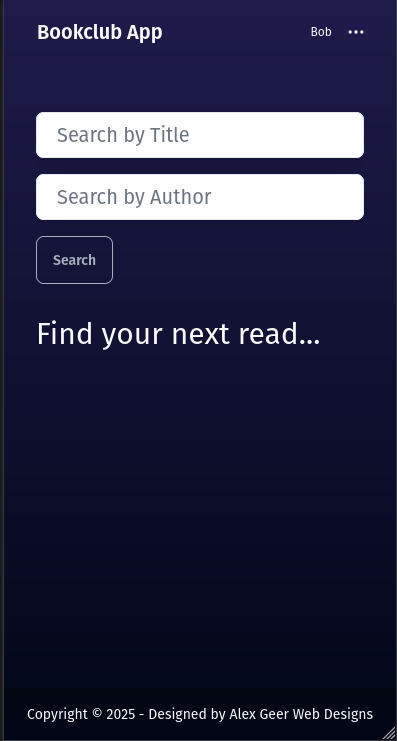
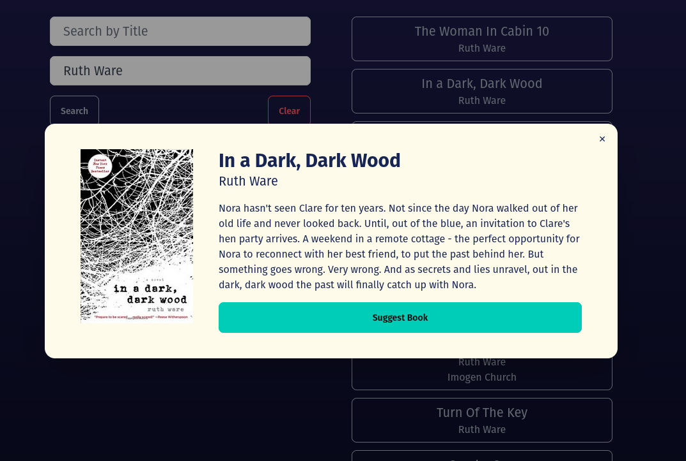
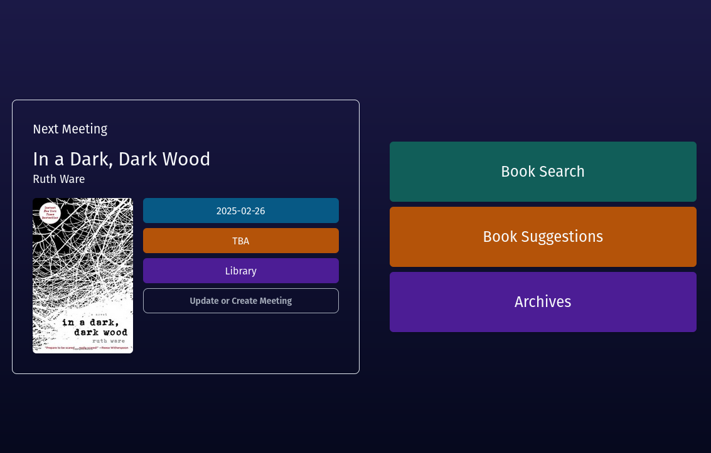

# bookclub-manager

> **This repository represents v1 of the Book Club Manager application.**
>
> The current deployed version is a lighter, frontend-focused rebuild. See **[bookclub_ui](https://github.com/agDesignz/bookclub_ui)** for the active codebase, and visit the live app at **[bookclub.cooldudeweb.com](https://bookclub.cooldudeweb.com)**.

---

## About this version

This is the original, fully containerized version of the Book Club Manager — kept here as a portfolio reference for its infrastructure architecture.

Where the current version uses a Supabase backend to reduce operational overhead, this version runs entirely on self-managed infrastructure:

- **Full Docker containerization** — every service (app, database, reverse proxy) runs in its own container
- **Docker network** — containers communicate over a private Docker network, not exposed to the public internet
- **Nginx reverse proxy** — routes external traffic to the application container, handles SSL termination
- **Docker Compose** — orchestrates the full multi-container stack for reproducible local and production deployments

This setup demonstrates end-to-end ownership of an application stack: not just writing application code, but configuring the infrastructure it runs on.

---

## Why it was rebuilt

Running a full containerized stack on a VPS requires ongoing maintenance. The rewrite to [bookclub_ui](https://github.com/agDesignz/bookclub_ui) offloads the database and auth layer to Supabase, making the deployed version simpler to maintain while keeping the React frontend as the primary codebase.

---

## Related

- **[bookclub_ui](https://github.com/agDesignz/bookclub_ui)** — current version (React + Supabase)
- **[bookclub.cooldudeweb.com](https://bookclub.cooldudeweb.com)** — live app

---

## Design

### Fully Responsive

### Cover Images Included

### Easy-to-read dashboard

---

## License

[Creative Commons Attribution-NonCommercial 4.0 International (CC BY-NC 4.0)](https://creativecommons.org/licenses/by-nc/4.0/)

## You are free to share and adapt this project for non-commercial purposes with attribution. Commercial use is not permitted.

_Built by [Alex Geer](https://alexgeer.dev)_
